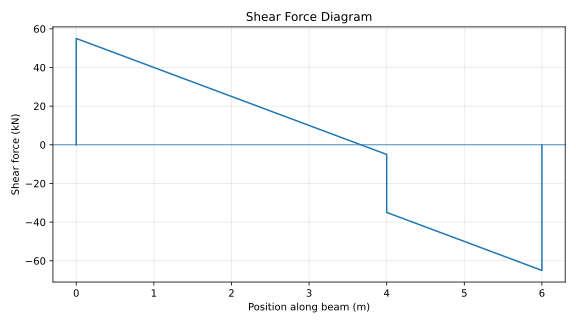
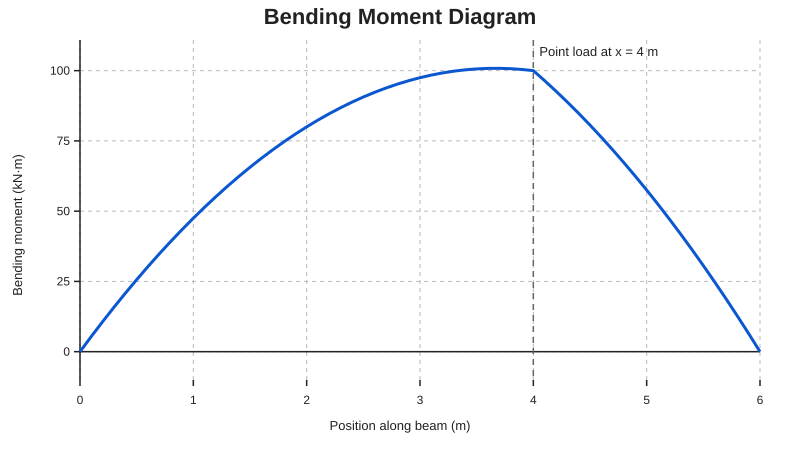

# Structural Engineering with Python

Python-based analysis and visualisation of a simply supported beam under a full-span uniformly distributed load (UDL) and a point load.

## Overview

This project translates basic structural mechanics into a small Python analysis tool. It calculates support reactions, shear force, bending moment and the maximum sagging bending moment for a simply supported beam.

The aim is to demonstrate how engineering calculations can be implemented, checked and visualised using Python.

## Current Features

- Simply supported beam analysis
- Full-span uniformly distributed load (UDL)
- Single point load at a user-defined position
- Left and right support reactions
- Shear-force values along the span
- Bending-moment values along the span
- Maximum sagging bending moment and its position
- Shear Force Diagram (SFD)
- Bending Moment Diagram (BMD)
- Basic input validation
- Automated validation tests for known beam cases

## Worked Example

The default example in `beam_analysis.py` uses:

- Beam span: **6 m**
- UDL: **15 kN/m** across the full span
- Point load: **30 kN**
- Point-load position: **4 m** from the left support

### Manual equilibrium check

The UDL produces a total load of:

`15 kN/m × 6 m = 90 kN`

Total vertical load:

`90 kN + 30 kN = 120 kN`

Taking moments about the left support:

`RB × 6 = (90 × 3) + (30 × 4)`

Therefore:

- `RB = 65 kN`
- `RA = 120 - 65 = 55 kN`

The Python calculation gives the same support reactions.

### Calculated output

```text
SIMPLY SUPPORTED BEAM ANALYSIS
----------------------------------
Left reaction: 55.00 kN
Right reaction: 65.00 kN
Maximum bending moment: 100.83 kN·m at x = 3.67 m
```

The maximum moment occurs where the shear force changes sign before the point load.

## Diagrams

### Shear Force Diagram



### Bending Moment Diagram



## Engineering Method

The program is based on static equilibrium:

- Sum of vertical forces: `ΣFy = 0`
- Sum of moments: `ΣM = 0`

For a section at position `x`, the program evaluates the internal shear force and bending moment from the loads acting to the left of the section.

The concentrated point load is applied only once the evaluated section passes its position on the beam.

## Project Structure

```text
structural-engineering-python/
├── README.md
├── beam_analysis.py
├── test_beam_analysis.py
├── requirements.txt
├── .gitignore
└── results/
    ├── shear_force_diagram.svg
    └── bending_moment_diagram.svg
```

When the program is run, it can regenerate the diagrams in the `results/` folder.

## How to Run

### 1. Clone the repository

```bash
git clone https://github.com/salimbukar3/structural-engineering-python.git
cd structural-engineering-python
```

### 2. Install dependencies

```bash
pip install -r requirements.txt
```

### 3. Run the analysis

```bash
python beam_analysis.py
```

The numerical results are printed in the terminal and the SFD/BMD files are saved in the `results/` folder.

### 4. Run the validation tests

```bash
python -m unittest test_beam_analysis.py
```

The tests check the worked example as well as standard central point-load and full-span UDL cases.

## Dependencies

- Python 3
- NumPy
- Matplotlib

## Assumptions and Limitations

This first version is intentionally limited to a basic statically determinate beam model.

Current assumptions:

- Beam is simply supported.
- UDL acts across the full span.
- Only one downward point load is included.
- Loads are static and vertical.
- Self-weight is excluded unless represented in the UDL.
- Deflection and stress calculations are not included yet.
- Material behaviour is not modelled in this version.

## Planned Development

Future versions may add:

- Beam deflection
- Young's modulus and second moment of area
- Bending stress calculations
- Multiple point loads
- Partial UDLs
- Additional beam configurations
- More validation examples

## Skills Demonstrated

- Structural mechanics
- Static equilibrium
- Shear-force and bending-moment analysis
- Python
- NumPy
- Matplotlib
- Engineering verification
- Automated testing
- Technical documentation

## Author

**Abubakar Bukar**  
MEng Civil Engineering, First-Class Honours

- Portfolio: https://abubakarbukar.netlify.app
- LinkedIn: https://linkedin.com/in/abubakarbukar
